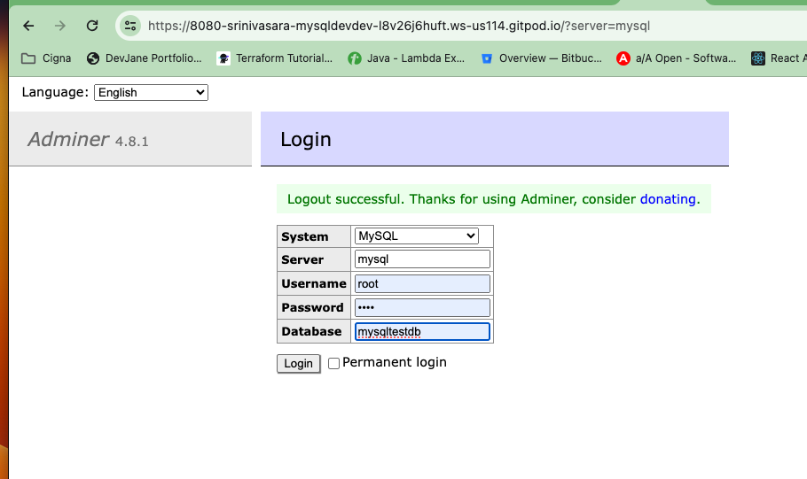

## MYSQL Docker-Compose
Reference Link
https://medium.com/@victoria.kruczek_15509/create-a-local-database-with-docker-compose-and-view-it-in-mysql-workbench-974aee047874

### Create a file name "docker-compose.yml"
#### Content of docker-compose.yaml
```
version: '3'
services:
 db:
   image: mysql:latest
   container_name: SriMySQLDockerComposeContainer
   ports:
     - "3306:3306"
   environment:
     - MYSQL_ROOT_PASSWORD=root
     - MYSQL_DATABASE=mysqltestdb
   volumes:
     - ./init:/docker-entrypoint-initdb.d
     - ./db:/var/lib/mysql
```

#### Command to Verify the Docker Compose file
```
docker-compose -v
```
output:
```
docker Compose version v2.27.0-desktop.2
```
#### Command to Run the mysql Docker - this will run mysql in foreground
```
docker-compose up 
```
#### Command to Run the mysql Docker - this will run mysql in background
```
docker-compose up -d 
```
### Command to Verify the Docker Compose file
docker-compose -v
output:
docker Compose version v2.27.0-desktop.2
### Command to Run the mysql Docker
docker-compose up

Created database using Docker-Compose file


### Create Database
```
CREATE DATABASE MySQLSriDB
```
### Use Database
```
Use MySQLSriDB;
```
### Create Table
```
use MySQLSriDB;
CREATE TABLE Customers (
     CustomerID MEDIUMINT NOT NULL AUTO_INCREMENT,
     CustomerName varchar(255) NOT NULL,
     ContactName varchar(255), 
	 Address varchar(255) NOT NULL,
     City varchar(255) NOT NULL,
	 PostalCode varchar(255) NOT NULL,
     Country varchar(255) NOT NULL,
     created_at TIMESTAMP DEFAULT CURRENT_TIMESTAMP,
     PRIMARY KEY (CustomerID)
);
```
### Insert data into table
```
Insert 
	into 
		Customers 
			(CustomerName, ContactName, Address, City, PostalCode, Country)
		values 
			('Alfreds Futterkiste', 'Maria Anders', 'Obere Str. 57', 'Berlin', '12209', 'Germany');
            
     
Insert 
	into 
		Customers 
			(CustomerName, ContactName, Address, City, PostalCode, Country)
		values 
			('Ana Trujillo Emparedados y helados', 'Ana Trujillo', 'Avda. de la Constitución 2222', 'México D.F.', '05021', 'Mexico');

Insert 
	into 
		Customers 
			(CustomerName, ContactName, Address, City, PostalCode, Country)
		values 
			('Antonio Moreno Taquería', 'Antonio Moreno', 'Mataderos 2312', 'México D.F.', '05023', 'Mexico');
            
     
Insert 
	into 
		Customers 
			(CustomerName, ContactName, Address, City, PostalCode, Country)
		values 
			('Around the Horn', 'Thomas Hardy', '120 Hanover Sq.', 'London', 'WA1 1DP', 'UK');
            
     
Insert 
	into 
		Customers 
			(CustomerName, ContactName, Address, City, PostalCode, Country)
		values 
			('Berglunds snabbköp', 'Christina Berglund', 'Berguvsvägen 8', 'Luleå', 'S-958 22', 'Sweden');
            
```    
### Connect to DB using workbench

```
properties are
ConnectionName: localhost
Connection Method : TCP/IP
HostName:127.0.0.1
Port:3306
Password:root
Default Schema:   // empty
```
### Select data from table
```
Select * from Customers;
```


